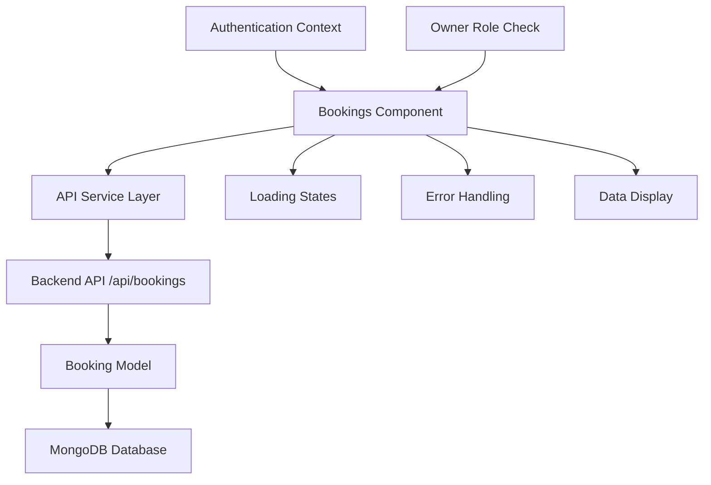

# Design Document: Dynamic Owner Bookings

## Overview

This design transforms the static owner bookings page into a dynamic, data-driven interface that integrates with the existing backend API. The solution leverages React hooks for state management, implements proper error handling, and provides a seamless user experience with loading states and real-time data updates.

## Architecture

The dynamic bookings page follows a client-server architecture with the following components:



The frontend component communicates with the existing `/api/bookings` endpoint, which already implements owner-specific filtering and proper authentication checks.

## Components and Interfaces

### Frontend Component Structure

**Enhanced Bookings Component**
- **State Management**: Uses React hooks (useState, useEffect) for data fetching and state management
- **API Integration**: Integrates with existing backend endpoints
- **Loading States**: Implements skeleton loaders during data fetching
- **Error Handling**: Provides user-friendly error messages and retry functionality

**Key State Variables**:
```javascript
const [bookings, setBookings] = useState([])
const [loading, setLoading] = useState(true)
const [error, setError] = useState(null)
const [retrying, setRetrying] = useState(false)
```

### API Integration Layer

**Booking Service Functions**:
- `fetchOwnerBookings()`: Retrieves bookings for the authenticated owner
- `handleApiError()`: Processes and formats API errors for user display
- `retryFetch()`: Implements retry logic for failed requests

### Backend Integration

The design leverages the existing backend infrastructure:

**Existing API Endpoint**: `GET /api/bookings`
- Already implements owner-specific filtering (`query.owner = req.user._id`)
- Returns populated booking data with property and tenant information
- Includes pagination support
- Provides proper authentication and authorization

**Data Flow**:
1. Frontend sends authenticated request to `/api/bookings`
2. Backend validates owner authentication
3. Backend filters bookings by owner ID
4. Backend returns populated booking data
5. Frontend processes and displays the data

## Data Models

### Frontend Booking Data Structure

The component will work with booking objects that match the backend model:

```javascript
{
  _id: "booking_id",
  property: {
    _id: "property_id",
    title: "Property Name",
    location: { address: "Property Address" }
  },
  tenant: {
    _id: "tenant_id",
    firstName: "John",
    lastName: "Doe",
    email: "john@example.com",
    phone: "+1234567890"
  },
  status: "confirmed", // pending, approved, active, completed, cancelled
  leaseDetails: {
    startDate: "2024-12-10T00:00:00.000Z",
    endDate: "2024-12-15T00:00:00.000Z",
    duration: 6
  },
  financialTerms: {
    monthlyRent: 1750,
    securityDeposit: 3500,
    totalAmount: 5250,
    currency: "INR"
  },
  createdAt: "2024-11-20T00:00:00.000Z"
}
```

### Status Mapping

The component will map backend status values to display-friendly formats:

```javascript
const statusConfig = {
  pending: { icon: FaClock, color: 'text-yellow-600', label: 'Pending' },
  approved: { icon: FaCheckCircle, color: 'text-green-600', label: 'Approved' },
  active: { icon: FaCheckCircle, color: 'text-blue-600', label: 'Active' },
  completed: { icon: FaCheckCircle, color: 'text-gray-600', label: 'Completed' },
  cancelled: { icon: FaTimes, color: 'text-red-600', label: 'Cancelled' }
}
```

## Error Handling

### Error Categories and Responses

**Network Errors**:
- Display: "Unable to connect. Please check your internet connection."
- Action: Provide retry button
- Implementation: Detect network connectivity issues

**Authentication Errors (401)**:
- Display: Redirect to login page
- Action: Clear authentication state
- Implementation: Use authentication context

**Authorization Errors (403)**:
- Display: "Access denied. Owner permissions required."
- Action: Redirect to appropriate dashboard
- Implementation: Role-based routing

**Server Errors (500)**:
- Display: "Server error. Please try again later."
- Action: Provide retry option with exponential backoff
- Implementation: Generic error handling

**No Data States**:
- Empty bookings: "No bookings found. Your rental requests will appear here."
- No properties: "Add properties to start receiving bookings."

### Retry Logic

```javascript
const retryWithBackoff = async (fn, maxRetries = 3) => {
  for (let i = 0; i < maxRetries; i++) {
    try {
      return await fn()
    } catch (error) {
      if (i === maxRetries - 1) throw error
      await new Promise(resolve => setTimeout(resolve, Math.pow(2, i) * 1000))
    }
  }
}
```

## Testing Strategy

### Unit Testing Approach

**Component Testing**:
- Test component rendering with different data states
- Test loading state display
- Test error state handling
- Test empty state display
- Test user interactions (retry button clicks)

**API Integration Testing**:
- Mock API responses for different scenarios
- Test successful data fetching
- Test error handling for various HTTP status codes
- Test retry logic functionality

**Property-Based Testing**:
The testing strategy will implement property-based tests to validate universal behaviors across different data inputs and states.

### Dual Testing Strategy

**Unit Tests**: Focus on specific examples, edge cases, and error conditions
- Test with empty booking arrays
- Test with various booking statuses
- Test error boundary conditions
- Test authentication state changes

**Property Tests**: Verify universal properties across all inputs
- Minimum 100 iterations per property test
- Each test tagged with: **Feature: dynamic-owner-bookings, Property {number}: {property_text}**
- Comprehensive input coverage through randomization

**Testing Framework**: Jest with React Testing Library for unit tests, and a property-based testing library (such as fast-check for JavaScript) for property tests.

## Correctness Properties

*A property is a characteristic or behavior that should hold true across all valid executions of a system-essentially, a formal statement about what the system should do. Properties serve as the bridge between human-readable specifications and machine-verifiable correctness guarantees.*

### Property 1: Loading State Display
*For any* API request in progress, the system should display loading indicators or skeleton loaders
**Validates: Requirements 1.2, 5.4**

### Property 2: Error Handling Response
*For any* API request failure, the system should display an appropriate error message and provide relevant user actions (retry, redirect, etc.)
**Validates: Requirements 1.3, 5.1, 5.2, 5.3**

### Property 3: Complete Booking Data Display
*For any* valid booking object returned from the API, all required booking information should be displayed including guest details, property name, dates, status, financial amount, and creation date
**Validates: Requirements 1.5, 2.1, 2.2, 2.3, 2.4, 2.5, 2.6**

### Property 4: Owner-Specific Data Filtering
*For any* authenticated owner user, the displayed bookings should only include bookings associated with that owner's properties
**Validates: Requirements 3.1**

### Property 5: Access Control Enforcement
*For any* non-owner user attempting to access the bookings page, the system should prevent access
**Validates: Requirements 3.4**

### Property 6: Current Status Display
*For any* booking displayed, the status shown should match the most current status from the database
**Validates: Requirements 4.1**

### Property 7: Retry Feedback
*For any* retry attempt on a failed request, the system should provide visual feedback during the retry process
**Validates: Requirements 5.5**